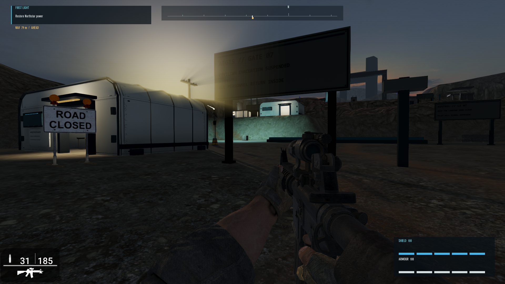
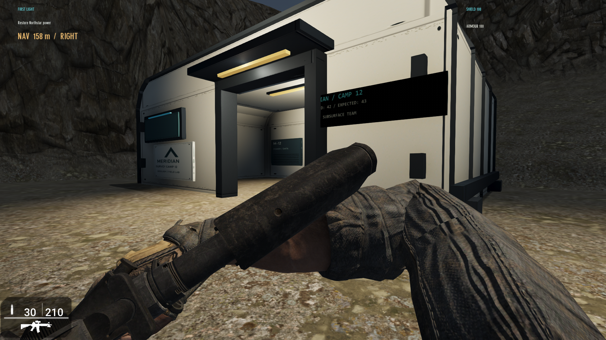
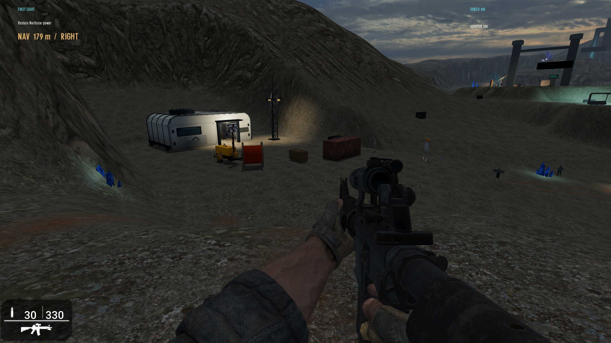
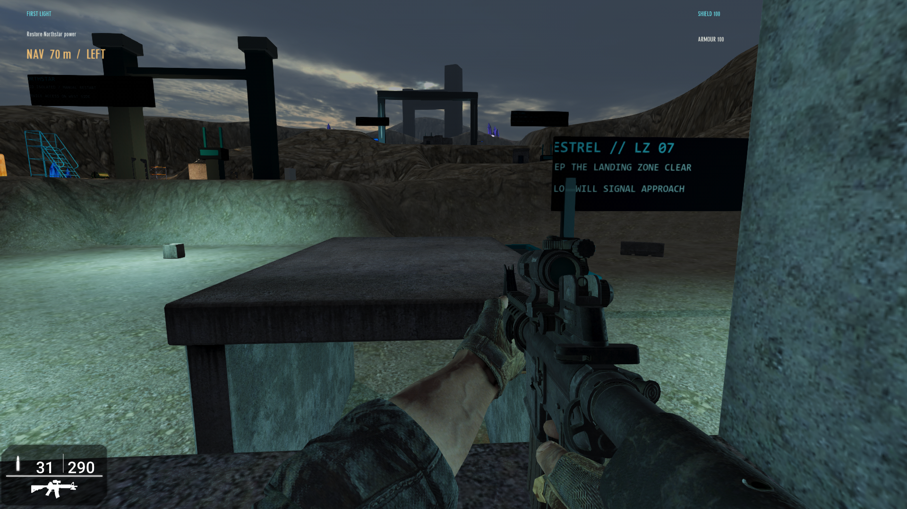
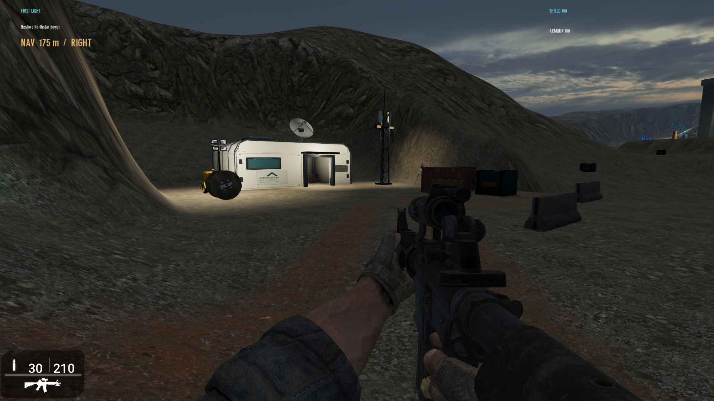
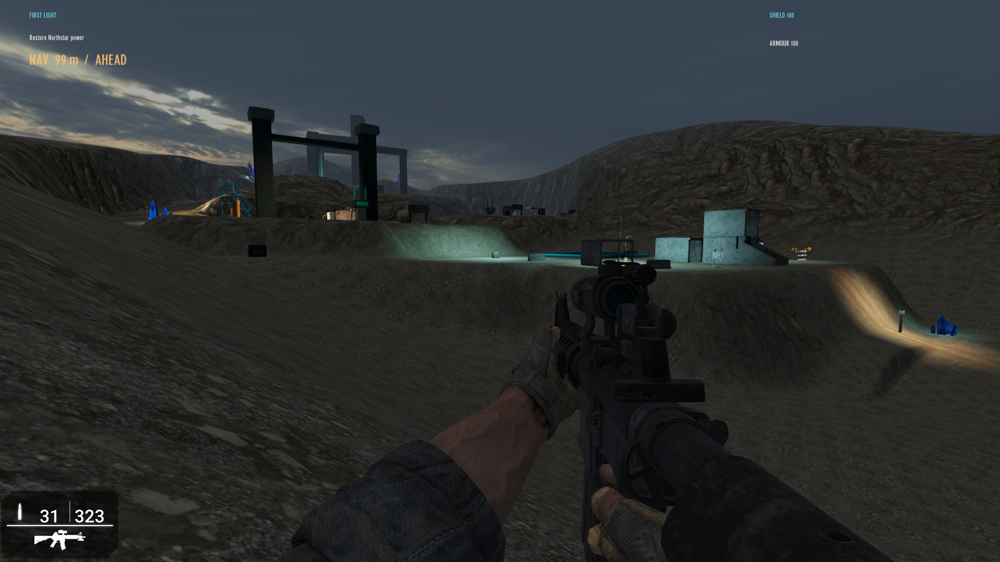
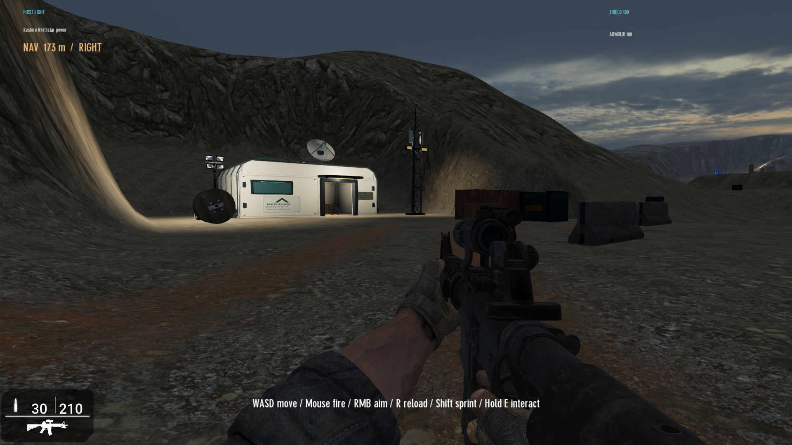
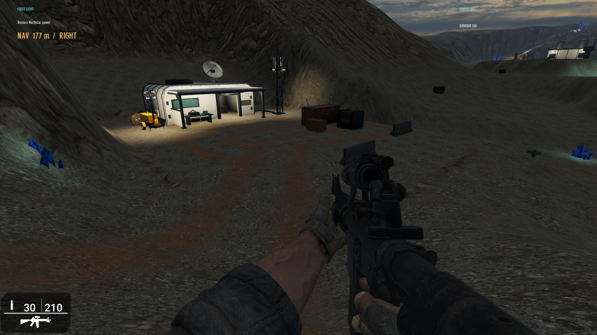

# First Light environment rebuild - native review pending

Baseline: remote main `0fbb6960c94168367c50c34692d6a2fb084d2e8b`.
This branch changes the actual First Light map. There is no showroom or separate
prototype map. It is not qualified for merge until the new native views pass.

## September 12 facility completion candidate

The latest user-supplied native view shows an oversized Gate 07 sign, intrusive
road-closure board, large HUD backings and skeletal downstream structures. This
pass replaces those authored structures rather than scattering more props.

- Operations: archive and crew modules connected by a covered service link.
  Reused desks/computers sit in the archive; lockers and a cot sit in the crew
  room. Shelves and trolley form a rear service area. The archive objective is
  inside the room, at its existing mission position.
- AEGIS: an enclosed control pavilion and two grounded relay cabinets with
  antenna spines replace the giant empty frame and disconnected urban modules.
- Mission equipment: the three 334-inch-tall relay terminals become 65-inch
  control consoles. Objective positions, scripts and ordering remain unchanged.
- Gate 07: smaller 96 x 36-inch route boards replace the 168 x 64-inch boards.
  The checkpoint board moves beside the office and receives a physical lamp and
  local light. Two concrete barriers replace the Earth road-closure boards.
- Lighting: local archive/crew/covered-link pools, restrained technical pavilion
  lighting, and reduced cyan spill across the extraction shelf. Two lights added.
- HUD: narrower objective/compass panels, intercardinal headings and a smaller
  vital panel with larger labels. Stock ammo and actual vital values preserved.

The Camp 12 lab/court, terrain sculpt/paint, water, sky/exposure, crystal and scrub
placement, music and mission logic are preserved. Binary comparison against the
previous committed map confirms terrain/paint/visuals are unchanged and all 32
existing enemy/objective transforms and scripts match. Architecture changes
collision and enemy sightlines: the defender at (1880,1090) now occupies the crew
room and needs a native combat/navigation check.

Current map SHA256:
`d2f3100fe3dda2a3a6038e13ce04305e21579416c24e8cfcfdee40fb0959e450`.
202 entities, 52 asset types, 35 lights. Full deploy/preflight passed: 38 mission,
HUD, reference and mesh-import checks; composition, grounding, indoor-console,
terrain/material and cache checks. Original models use the existing coordinated
Meridian textures. Installed DLC is referenced only; no licensed payload added.

**Not native-approved.** The screenshot above predates these changes. Current
session tools expose browser control only; native MAX capture/input is disabled.
No new screenshot has been fabricated or substituted. Keep the PR unmerged until
room traversal, collision, console use, AI navigation, sign readability and
lighting are checked in MAX. See `NEXT_PLAYTEST.md` for the tuning handoff.

## Why the previous camp was rejected

The supplied September 8 native screenshot, compared with the concept reference,
shows the wrong scale and material hierarchy: a small concrete hut in a uniformly
rocky basin, exposed equipment, unrelated pools of light, and conspicuous blue
crystals in the foreground. Moving one barrier or tuning exposure did not address
the main architecture or the missing service-road surface.

## September 11 native milestone

The user supplied a native MAX close-up and an opening gameplay view, and approved
preserving the current progress while requesting further refinement. The existing
source/map milestone is `157319c` (map SHA256 `a93f9f89d8c12d3ab19174f18eacaed65f830060af8a44c7d6e8de9d7cba1a8f`). The September 11 runtime log
records the revised insertion at X=-900/Z=-8200 and subsequent normal play through
Camp 12 toward Gate 07.

The lab silhouette, ivory panels, open entrance, interior ceiling and warm
practicals are visible in the native image. This is evidence of improved rendering,
not a complete collision, audio or level-quality qualification. The image also
exposes a defect: the evacuation panel overlaps the right doorway jamb and its
atlas-style UV margins crop the leading characters. Fix that panel before merge.
The second supplied image includes unrelated desktop content and is not stored here.

The remaining review includes the court, doorway traversal, outbound road and
atmosphere. Do not treat the positive milestone as proof of all outstanding gates.

## September 11 evacuation-panel correction

The close-up shows the old 88-inch board crossing the right-hand jamb. Its generic
7% UV inset also clipped the first characters and the outer printed border.
The replacement is a 60 x 25 x 2-inch painted panel at (-2219, 548, -7104),
rotation 270, editor scale 100. Its back sits on the existing facade plane.
In lab-local coordinates it spans X=136..196 and Y=48..73: clear of the
jamb (ending at X=132) and both hinge rows. No doorway or furniture is moved.

The panel uses a matching 768 x 320 original ivory/teal texture, dark readable
lettering, full front-face UVs, plain painted edges, and nonmetallic material
response. It preserves the evacuation count and missing-person story. This
replaces the existing panel; it adds no environment objects or lights.
Only the Camp 12 panel is changed. Other destination signs retain their existing
art and placement for a later scoped review.

This follow-up needs a native close-up before visual approval. The supplied image
above is the earlier version and must not be represented as the corrected result.

## September 11 work-court refinement

The user supplied a native overview and a new concept reference. The native image
below is the **before** view for this follow-up, not a render of the new layout.
It shows the generator and oversized reel competing with the lab entrance, an
isolated crate/container, and a court without a clear working edge.

The concept informs the functional grouping and lighting, without importing its
larger excavation complex or changing Meridian's identity. This follow-up:

- Moves the existing generator to the south edge, clears the door approach, and
  reduces the reel from 84% to 64% (approximately 1.65 m tall). A single warm pool
  originates at the measured lamp array on the generator's existing fixture.
- Groups the existing container and supply crate on the north side. The two
  existing survey instruments sit near the mast, with all feet on the flat bench.
- Replaces the isolated roadblock with two low concrete edge markers from the
  installed military family already used in First Light. Each is about 3 m long
  and 1.04 m high. Their end-origin pivots are accounted for explicitly; the gap
  between their ends stays approximately 6.1 m wide.
- Continues the existing wheel-band material through the native court so the
  arrival and outbound service road share a visible surface cue.

The core contains 13 environment objects. Only one additional environment object
and one light are introduced; there are no new asset families, mesh payloads,
mission systems or showroom maps. Installed DBO vertex bounds were read locally
to check scale, footing and spacing; geometry was not copied into the repository.
These bounds checks do not prove native collision or material quality.

The lab, mast, sign, interior furniture, native terrain heights, route control
points, brineglass, sky/exposure settings, combat positions, objectives, mission
scripts and music are preserved from the panel-correction candidate. The archive comparison preserves terrain sculpt, settings and atmosphere byte-for-byte.
Only entity records, asset-bank ordering and 90 court wheel-band paint cells change.
The changed court still needs native views from the approach, door and outbound road. In
particular, judge barrier bulk and the new practical's spill before accepting it.

## September 11 downstream signage correction

The next native user screenshot exposes cropped initial letters, near-black
billboards, floating panels and the extraction sign's posts crossing its face.
The image below is native evidence of those defects **before** this correction.

Five destination boards (Gate 07, Northstar, Operations, AEGIS and extraction)
now use original 1008 x 384 ivory/teal artwork, dark lettering and full front-face
UV coverage. Unprinted edges and backs sample blank paint instead of repeating
text. Paint is nonmetallic with restrained reflectance; no glow or extra light
sources compensate for unreadable artwork.

Panels shrink from 440 x 110 to 168 x 64 MAX inches (4.27 x 1.63 m), with their
bottoms 84 inches above the native ground at the sign origin. Rear posts are
8 inches thick and sit behind the panel, leaving approximately 3.15 m between
them. Footings follow native terrain height individually. The extraction board
retains its existing separate support entity; the other boards include their
supports in the same original mesh. No new entities or installed assets are added.

The Northstar board moves from (-1250, -1675) to (-980, -1450) onto the adjacent
level shelf: the original point put its feet across a slope with roughly 10-inch
height variation. Other sign X/Z positions and story text are preserved. Camp 12's
panel, buildings, terrain, lighting, combat, mission scripting and music retain
the preceding candidate. The large unfinished skyline structures visible in the
screenshot are still future art work; this signage correction does not qualify them.

Full-front UV coverage, post clearance and footing are checked geometrically.
The texture artwork was inspected directly, but that is not a MAX material or
collision review. A new native view remains necessary before accepting this pass.

## September 11 connected world detail and floating-asset removal

The user requested tire tracks, water, glowing areas and communications equipment,
then supplied a native AEGIS view showing unsupported blue architectural trim and
stairs with no destination. The full desktop image contains unrelated applications
and is not copied into this repository.

The installed `CS_Wall_01_NeonDecor_Blue_Corner.dbo` has local Y bounds
162.37..220.00 inches. At the authored 58% scale its visible base floated about
94.2 inches above terrain. Both copies are removed, along with the disconnected
`CS_Steps_01` at AEGIS. Lowering a facade ornament to the ground would not supply
its missing architectural context. The existing AEGIS frame and mission equipment
remain; this pass does not claim that the wider landmark composition is finished.

The new detail is connected to existing places:

- The Meridian lab gains a 96-inch (2.44 m) parabolic communications dish on a
  roof-mounted pedestal. Its paired skins, rim, rear ribs and feed arms use the
  existing original ivory/graphite/teal material suite. The lowest rim clears the
  roof, and the roof pad meets the existing shell. No new freestanding camp prop.
- Two compact radio panels attach to the existing survey mast above its work lights.
  Their small cyan indicators use the existing emissive atlas, without new point
  lights. Camp 12 still contains 13 environment objects.
- Paired native road paint bands widen from 28 to 46 inches. Outside the camp and
  combat pads, shallow 3-inch wheel grooves follow the existing road centreline.
  They are authored wheel ruts, not a simulated tire imprint system.
- Two native terrain depressions at (650, -5590) and (930, -5380) retain residual
  brine beside the lower approach. Their beds sit at Y=35; the native water plane
  is Y=65, about 30 inches (0.76 m) deep at the centres. Basalt material marks the
  pocket floors. The travel corridor is explicitly protected from the cut.
- MAX water is enabled through both `ggterrain.dat` water_height and visuals.ini,
  using a dark blue-green color, low wave amplitude and slow motion. This is MAX's
  level-wide water plane, exposed in the low pockets; inspect the distant horizon
  and other low ground for unwanted ocean visibility before approval.
- Two small blue/cyan brineglass deposits and restrained lights sit at the pocket
  edges. Total formations increase from 10 to 12; the three violet formations
  and their progression remain unchanged.

Installed asset bounds were read locally, without copying DLC payloads. The dish
and radio geometry are original procedural additions. Mission scripts, music,
combat positions, sign treatment and existing camp equipment are preserved.

Native-map regression checks sample shallow pool depth and verify dry service,
return and gameplay locations. They reject the floating corner and orphan stairs
from the rebuilt asset bank. Mesh import and winding checks cover the dish/radios.
These checks cannot approve water appearance, reflected sky, materials, collision
or composition. Required next MAX views: AEGIS after removals, Camp 12 roof/mast,
and the lower approach showing ruts, pool shoreline and brineglass in context.

## Gate 07 and Northstar: facilities and optional interactions

The user's latest native images confirm the camp's revised roof dish, mast,
lighting and equipment groups in play, while showing broad empty shelves and
skeletal downstream architecture. They requested a wider level-design pass and
promotion when review permits. These images precede the changes below.

Gate 07 now has a complete inspection office at (-520, -3300), using the tested
Meridian shell without its roof dish. An original FIELD SERVICES atlas replaces
Camp 12-specific lettering. Its desk, chair and usable computer fit inside; the
monitor's measured negative Y origin is compensated so its base meets the desk.
The office fronts onto the arrival lane. A grounded communications mast, generator,
freight container and two supply crates form a compact logistics area across the
lane. Six disconnected urban modules are removed. The cargo footprints were read
from installed DBOs and checked for level feet and non-overlap.

Northstar gains a maintenance office at (-650, -1400), also furnished and usable.
Its giant empty arch becomes a solid power enclosure with panel ribs, control
faces, mounted work lamps, two cylindrical exhaust towers and low feeder conduits
to the western generator cluster. Three disconnected urban modules and the stairs
with no landing are removed. Existing generators, tanks and the mission's power
terminal retain their positions. The enclosure occupies the old stack footprint
and stays clear of the objective and enemy starting positions.

The existing route surface continues from Gate 07 onto Northstar's shelf. Several
large cyan/orange light pools become smaller practical pools at actual fixtures:
inspection-room ceiling, gate mast, power-block lamp housings and maintenance room.
Three doorway/interior lights are added. Camp 12, brine pools, terrain heights and
main mission objective positions remain unchanged.

Two optional computer interactions use the existing E prompt and radio-caption
presentation. The inspection log explains the civilian road closure; the
maintenance record describes the deliberate isolation of the shelter feed.
Reading them triggers the existing human-discovery score state. They do not advance
mission stages, increase collectible counts, grant supplies or spam repeated text.
Lua checks cover both prompts, unchanged progression/counts and one-shot behavior.

Native review is still required for these new facilities: inspection approach,
inside both rooms, Northstar power-terminal approach, route clearance, light spill,
computer use and enemy navigation. The user has approved progress, but the new
geometry has not been shown in MAX yet; do not substitute Python checks for that
review or claim that the previously empty areas are now finished.

## September 10 opening-view correction

The supplied native opening screenshot shows the lab at the far left, a brightly
lit bank behind it, and distant structures dominating the centre. Surface detail
alone did not establish the camp as the first destination. The full desktop image
includes unrelated private applications and is not copied into this public repo.

- Normal insertion moves from (0, -9500) to (-900, -8200), on the existing descent.
  Its marker faces the camp court at 309.32 degrees. The lab is approximately 44 m
  away instead of 82 m. This changes the initial view and shortens the arrival walk;
  it does not move enemies, objectives or the established service-road spine.
- Native terrain directly behind the lab becomes a shallow backed-in bench.
  At X=-2800/Z=-7270 its height drops from 1275.8 to 630.2 inches; the court remains
  at 500. The enclosing ridge returns farther west. No cave or geology props are
  introduced, and existing lab/furniture footing stays level.
- The existing mast moves to (-2145, -6960), on the court's north side. Its practical
  light follows it, with range reduced from 540 to 330 inches and a subdued amber.
  Interior and entrance ranges become 250 and 240. The stock 45-inch marker offset
  is removed for these three lamps so the authored source heights match fixtures.
- The first two small brineglass clusters move alongside the shortened descent,
  outside the camp core. Their small lights also lose the unintended height offset.
  No new formations, props, light sources or asset families are added.

Checks sample the serialized terrain for an unobstructed entrance sightline,
moderate bank grade, grounded mast feet and light offsets. Source comparisons
confirm unchanged road grades and downstream geography/placements. Angular framing
checks measure a larger lab silhouette near the opening centre. These are structural
safeguards; the corrected view still needs native screenshot review.

## Current production candidate

- One original Meridian field lab replaces the six street-wall/roof pieces. Its
  shell measures 420 x 260 MAX inches (10.67 x 6.60 metres), with a chamfered crown,
  structural ribs, transport rails, roof service equipment and recessed entrance.
  The shell with roof communications equipment contains 1,340 triangles; its opening is approximately 100 x 101 inches.
  There is no generated floor or entrance step over the native terrain.
- The lab uses an original ivory/graphite/teal material atlas with seam wear,
  fasteners, Meridian identifiers, restrained cyan trim and amber practical strips.
  The coordinated 4096 x 512 albedo, normal, surface and emission atlases are
  deterministic outputs of `meridian_fieldkit.py`. Paint remains matte and
  dielectric; alloy ribs and exposed fasteners use a restrained metallic response.
  Surface seams and fasteners now sit inside the UV islands instead of outside
  the sampled crop. Printed Meridian labels stay flat. Lamps retain smooth normals.
  Upper end-panel UVs have nonzero area for stable normal-map tangent frames.
  No third-party model or DLC texture is embedded in this kit.
- The lab upper end panels now have separate inward and outward faces. The prior
  outward-only fans could disappear from an interior view under backface culling.
  New sightline checks reproduced that defect and pass after the repair. The
  ceiling strip now has a housing that meets the ceiling, without adding a light.
- The original mast is now a narrow braced truss with two lamp housings and an
  antenna. It sits at the north edge of the court. Its light marker coincides
  with the fixture height; the other two camp lights serve the lab and doorway.
- Existing installed desk/chair, generator, cable reel, cargo container, supply
  crate and two survey instruments remain, with two low court-edge barriers.
  They form work, power and logistics groups around the larger lab. Camp 12
  contains 13 environment objects including its existing route beacon.
- The court pad extends west to support the complete shell. Terrain height at
  the lab corners and mast base is 500 inches. Existing low terrain shoulders
  protect the site, and the insertion shoulder cut retains its facade sightline.
- The insertion-to-Gate service route and Camp 12 court are painted in native
  terrain data: installed mat23 mineral fines, with narrow mat16 wheel bands.
  There are 4,949 painted cells. Rocky slope materials remain outside the road.
  No snow material, coplanar floor, road mesh or decal overlay is used.
- The first brineglass exposure moves off the near foreground to the descending
  route. The first five mineral light sources have less spill. Ten formations,
  including three later violet formations and their two existing procedural
  texture artworks, remain. No crystal forest or additional light array is added.
- The roster remains on the lab wall and retains the missing-person clue.

## Gameplay and build verification

Current build: 195 entities, 61 asset types, 32 lights. Mission/score Lua, all three
music masters, combat/objective positions, route control points and downstream
architecture sources are unchanged. Insertion now starts farther down the existing approach and faces the camp court,
as described above. The Camp 12 ammo pickup remains ground-relative at its existing
X/Z. Downstream terrain heights remain unchanged; the road's material is authored
through the scoped native paint mask.

Passed: 27 mission/content checks, Lua 5.2 compatibility, composition safeguards,
installed Assimp import, encrypted map CRC/resource references, the local baseline
scope comparison, and field-kit checks covering actual door clearance, triangle
winding, paint row orientation and preservation outside the owned route.

MAX has launched this candidate and reached its title page. Startup is not an
in-level visual or collision pass. New original art files are intentional game
content; runtime caches, testmap state, savegames, logs and local references are
excluded from Git.

Current map SHA256: `df4bdd42113f3f8c72161f40a73a4eee39c50e9ae5568afa371114dc81e69a28`

## September 12 Operations workstation support correction

Two existing Operations computers had a measured 30.65-inch (78cm) air gap
above their desks. Both also shared the corner-origin position of their desks,
leaving the computer footprint outside the working surface after rotation.
Read-only inspection of the installed DBO files confirmed desk top Y=35.6557
and computer base Y=-13.6167. At 90% scale the corrected computer origin is
44.3452 inches above the desk origin, with a local (25,-25) offset transformed
through the desk's 90-degree yaw. No installed asset payloads are copied.

A physical-support regression checks all four desk computers for vertical contact
and complete footprint containment under their actual rotations and scales.
It rejects the old map placements and passes the rebuilt map. Full preflight passes;
archive comparison confirms only the two computer transforms differ.
This correction adds no assets and changes
no terrain, lighting, mission logic or combat. Native appearance remains pending;
the current tool session exposes browser control but disables native app control.

## September 12 Camp 12 sheltered work bay

The user's native view below is the **before** image. It shows the accepted lab
surrounded by disconnected equipment, with the reel hiding the generator and
little definition between the road and working court. The earlier concept's
useful direction is attached shelter, functional utility connections and warm
human activity, rather than its much larger excavation complex.

The existing Meridian lab now includes an attached 9.86m-wide, 3.15m-deep canopy.
Its ivory roof joins the facade, with a graphite front beam, two corner posts,
short braces and a low wind screen beside the bench. The doorway and its covered
approach remain open; no floor slab is introduced. The left side contains a
small sample bench with drawers, a closed specimen case and an instrument. A
single additional amber practical mounts under the canopy above this work area.
The shared Gate 07/Northstar service shell does not receive these additions.

Two low feeds connect the generator and survey mast to side-mounted lab terminal
boxes. This is one original utility assembly using the existing material suite,
entirely on the native camp pad and outside the entrance and vehicle lane. The
reel moves behind the generator-side work area at 44% scale, freeing the front
view of the generator. Its light range drops from 420 to 280 inches and its
color becomes warmer, reducing spill onto the broad rear bank.

A painted delivery turnout branches from the through-road and stops beside the
logistics area. A narrow basalt shoulder outlines the graded court. Native
terrain remains the walking surface; its heights, downstream paint, combat,
objectives, music and brineglass placements are unchanged. Camp environment
entities increase from 13 to 14, including the nearby route marker. No licensed
payloads are added.

Review the **new native result** from the supplied approach, under the canopy,
and looking back from the outbound route. In particular, check canopy silhouette,
doorway collision, the bench's scale, utility contact, lamp glare and turnout
readability. The source checks are not native approval. No after screenshot is
available from the current tool session, which disables native app control.

## September 12 HUD and surface-depth candidate

The user compared the native image below with a generated AAA-style concept.
This image shows the canopy in MAX but precedes this HUD/material pass. The
concept guides hierarchy, wet highlights and sparse scrub; it is not evidence
that MAX can reproduce its lighting or detailed cliff geometry exactly.

- A native sprite HUD gives mission text a compact translucent backing, adds a
  heading compass with an objective-bearing cursor, and moves shield/armour to
  segmented lower-right meters. Values remain live; partial segments represent
  partial charge. The stock ammunition display remains authoritative. No invented
  grenade or medkit counts are shown. The original white sprite texture is 4x4.
- The crystal generator's side/crown winding was inward. A radial-normal check
  proved the defect; reversing triangle winding restores outward facets. Original
  mineral albedo and dielectric roughness maps now differ from the emission map,
  with stronger surface reflectance and restrained internal glow. This is an
  opaque mineral material, not a claim of refractive glass.
- Three installed `Max Collection\\Cellar\\Small Puddle.fpe` instances use the
  asset's existing planar-reflection material. Their measured local plane is
  Y=1.05751; corrected placements sit 0.4 inches above the exactly flat camp pad.
  Every mesh vertex was checked for this clearance. No global water height or
  terrain geometry changes are made, and no reflective floor plane covers the camp.
- Eight installed `Max Collection\\Shrubs\\Desert Bush - Form A.fpe` tufts use
  40–55% scale on court margins, with buried root knots and physics disabled.
  Its installed preview shows dry pale scrub, not lush green foliage. Installed
  mesh bounds were measured; no plant models or textures are copied into Git.
- The installed sunset sky replaces overcast. Exposure and bloom stay restrained;
  a low warmer sun is paired with the existing cool ambient fill. This affects
  the whole level and requires skyline/readability review downstream as well.

Native review must check HUD legibility at the player's resolution, sprite
ordering/pause behavior, crystal lighting from both sides, puddle reflections and
frame time, scrub roots, and shadow/readability changes from the low sun. The
current tools cannot capture native MAX, so this remains a review candidate.

## Original-art load freshness

The launcher now hashes the original First Light X/FPE/PNG source bundle before
native launch. On a changed or previously unverified bundle it removes only the
compiled DBO siblings of those original meshes. Unchanged bundles keep their
compiled copies. Installed DLC and unrelated caches are not touched. The local
stamp is ignored by Git; the launch manifest records its content signature.

This supplements MAX's timestamp freshness checks. Older compiled files were
present beside newer source meshes, but this is not proof that MAX displayed
stale meshes in the supplied images. Six temporary-file tests cover first launch,
reuse, content changes with preserved timestamps, texture/material changes,
unowned files and invalid/missing model references. Native appearance and
collision still require the views below.

## Meridian material provenance and limits

MAX's [surface shader](https://github.com/Dark-Basic-Software-Limited/GameGuruMAX/blob/3e21f674d84b6e631f6e026cf23fbc7e1854ca61/GameGuru%20Core/Guru-WickedMAX/GGTerrain/CustomShaders/brdf.hlsli#L269)
multiplies roughness by G, metalness by B and reflectance by A; R supplies primary
occlusion when enabled. Original field-kit surface maps keep R/A at 255 and encode
roughness/metalness locally. The FPE multipliers are 1, reflectance remains 0.04,
and normal strength is 0.65. No painted shadows or baked occlusion are fabricated.

Channel checks cover every normal's length/direction, emission restricted to light
tiles, paint/alloy distinction, visible detail within UV margins, noncollapsed UV
triangles, reproducible generation and deployed FPE references. An authoring-only
channel preview was inspected. It is not a native render or visual approval.
Native material response, tangent orientation at runtime, glare and distant mip
behavior remain review requirements. This material pass changes the existing
lab/mast treatment; it adds no props, lights, terrain or gameplay systems.

## Native paint provenance

The format is taken from MAX's own `GGTerrain_GetMaterialIndex`,
`GGTerrain_GetPaintData` and `GGTerrain_SetPaintData` in
[the engine source](https://github.com/TheGameCreators/GameGuruMAX/blob/main/GameGuru%20Core/Guru-WickedMAX/GGTerrain/GGTerrain.cpp).
Paint is a 4096 x 4096 byte map. Zero selects height/slope materials; nonzero values
are one-based material IDs. Paint uses ordinary Z rows, unlike the existing
reversed sculpt buffer. Tests guard this difference and check untouched samples
outside the authored route. Installed terrain texture payloads remain local.

## Outstanding native gate

The September 11 user-supplied native views show the new lab and approach in
normal gameplay and informed the panel correction. The corrected panel and the
remaining viewpoints below still need native review. That earlier session encountered a Windows capture-interface error. In the
current session native desktop control/capture is disabled; only browser control
is exposed. No generated render or structural
test is offered as a substitute for native evidence.

Required next views:

1. Insertion ridge and descent: lab silhouette, brineglass restraint and road read.
2. Camp court at player height: field-lab scale, panels, ground transitions and light.
3. Walk through the lab doorway and look back: collision, roof/wall fit and work area.
4. Camp exit toward Gate 07 / Northstar: uninterrupted service-route continuity.
5. Dusk skyline and mineral close view: exposure, material response and atmosphere.

Reject or revise any broken material, overlap, floating object, unreadable route,
or toy-like shell. The present work is a concrete art-direction rebuild to review;
it is not a claim that the concept's finish has been achieved. Downstream landmark
finish and further terrain silhouette work require later native evidence.
