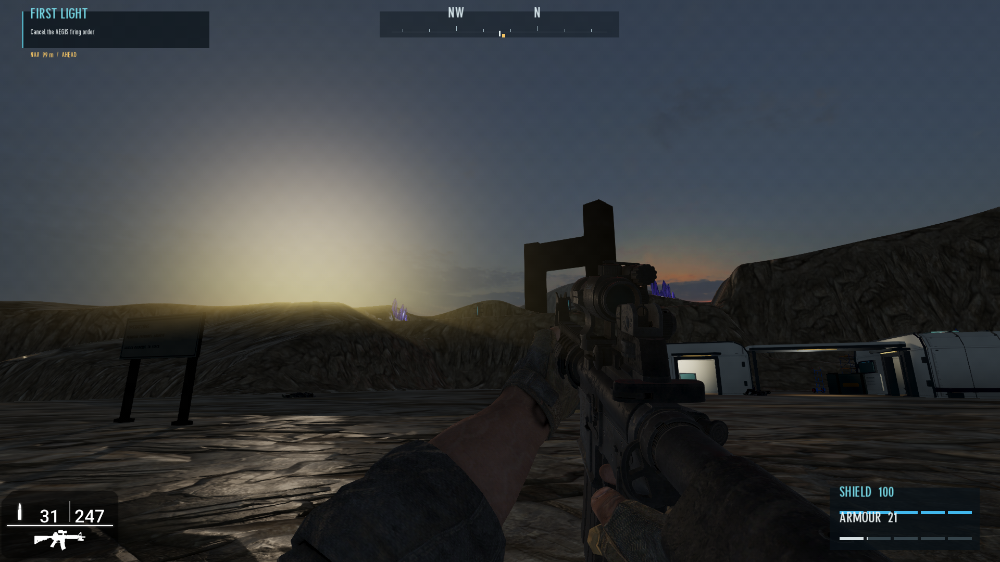

# Vesper orbital sky

Original AI-generated full-sphere panorama for the actual First Light sky.
`vesper-orbital-panorama.png` is retained unchanged. `projection-preview.png` is
an offline texture projection, **not a native MAX screenshot**.

The design uses a blue-grey crescent gas giant, sparse stars, a faint galactic
band and thin copper twilight. There are no painted terrain/building silhouettes.
Longitude zero faces +Z; increasing longitude turns toward +X. The generated
planet is near west-northwest, above the horizon. Verify orientation in MAX.

`tools/build_vesper_sky.py` resamples the 2:1 source to a six-face 1024px RGBA8
DDS cube with eleven mip levels. It writes `Files/skybank/vesper_orbital`, its
`skyspec.txt`, and the asset-picker preview. The source and converter are part of
the build fingerprint. The cubemap is original art, not copied licensed DLC.

MAX's official M-Sky.cpp discovers custom-project skybank folders by skyspec.txt,
then loads `<folder>/<folder>_cube.dds` directly. No DBO sky dome is needed in this
Wicked renderer path. Source inspected September 12, 2026:
https://github.com/TheGameCreators/GameGuruMAX/blob/main/GameGuru%20Core/GameGuru/Source/M-Sky.cpp

The actual map selects `vesper_orbital`; light shafts, lens flare and procedural
cloud coverage are disabled. Sun intensity changes from 1.65 to 1.35, sun RGB
from 255/211/163 to 255/219/186 and sun angles to X82/Y280. Exposure stays 0.84,
manual exposure remains enabled, bloom stays 0.08 and local practical lights stay
intact. These are a reviewable lighting candidate, not a verified native grade.

Review in MAX: opening Camp 12 approach, west/northwest from Operations, all four
cardinal horizon joins, zenith/nadir, readable terrain in shadow, and puddle
reflections. The native shader may orient or grade the map differently from the
offline preview. Do not approve a merge from the preview or structural tests.

Regenerate texture packaging with `python -B tools/build_vesper_sky.py`, or use
`python -B tools/firstlight_playtest.py deploy` for the complete game build.

Validated candidate map SHA256: `1edc11ef4a09a5e65be12d66cd6fa8ef67379e4b392f60c9fda5e1bf27986959`.
Combined preflight passed with 44 mission/HUD/reference checks,
combat geometry, telemetry, materials/footing and cubemap validation.
